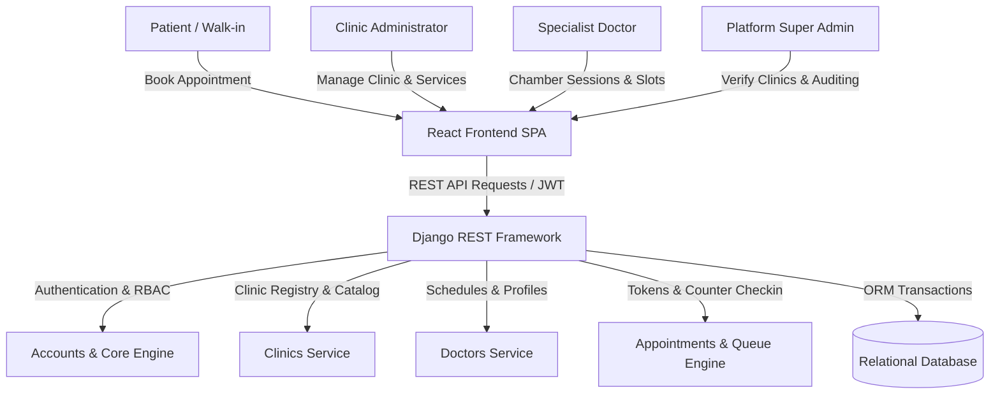

# 🏥 Smart Clinic — Multi-Clinic Healthcare Management & Telehealth Platform

<div align="center">


[](https://react.dev/)
[](https://tailwindcss.com/)
[](https://www.djangoproject.com/)
[](https://www.postgresql.org/)
[]()

**A modern, distributed healthcare ecosystem bridging Clinics, Specialist Doctors, Patients, and Platform Administrators across Bangladesh.**

[Explore Features](#-key-features) • [System Architecture](#-system-architecture) • [Quick Start](#-quick-start-guide) • [API Documentation](#-api-documentation)

</div>

---

## 🌟 Overview

**Smart Clinic** is an enterprise-grade healthcare management and digital appointment orchestration system. Built for the modern clinical ecosystem, it eliminates waiting room congestion, streamlines doctor-clinic partnerships, empowers clinics with virtual tour showcases, and delivers real-time live digital chamber queues for both online bookings and walk-in counter patients.

---

## ✨ Key Features

### 🏢 Clinic Administration & Management
- **Guided Clinic Onboarding**: Automated profile completion, geolocation coordinates capture (`📍 Use My Current Location`), certificate verification, and super-admin approval gate.
- **Visual Clinic Decorator & Virtual Tour**: High-resolution gallery management, virtual tour rooms (Reception, Chambers, Pathology, Emergency OT), with cover photo curation.
- **Clinical Services & Diagnostic Catalog**: 1-click bulk loading of standard Bangladesh diagnostic tests (ECG, USG, CBC, Fasting Glucose, Lipid Profile, Dental Scaling, etc.) with custom BDT pricing.
- **10-Point Facilities Matrix**: 24/7 Emergency, In-house Pharmacy, On-site Pathology Lab, ICU Beds, Wheelchair Accessibility, bKash/Card payments, and Blood Bank integration.

### 🩺 Specialist Doctor Ecosystem
- **Multi-Clinic Practice**: Doctors can accept invitations or request chamber slots across multiple registered hospitals and clinics.
- **Live Reception Chamber Session**: Real-time doctor chamber statuses (`In Chamber`, `Prayer Break`, `In Transit`, `Emergency`, `Session Completed`).
- **Waiting Room Delay Broadcast**: Real-time delay broadcast with custom announcements pushed directly to patient waiting monitors.

### 👥 Reception Desk & Digital Live Queue
- **Walk-in Patient Counter**: Instant walk-in registration with cash payment recording and printable thermal token receipts.
- **Serial Advancement**: Call Next, Skip & Hold, Recall, and Reset controls for receptionists and chamber assistants.
- **Public TV Queue View**: Live TV chamber display screen for waiting lounges showing currently serving serial numbers and upcoming patients.

### 📱 Patient Experience & Booking
- **Smart Clinic & Doctor Search**: Multi-filter discovery by city, division, medical department, consultation fee, and available amenities.
- **Bilingual Interface**: Seamless instant English / Bengali (বাংলা) localization.
- **Digital Appointment Pass**: Real-time token tracking, preparation instructions, and instant confirmation flow.

### 🛡️ Super Admin Control Tower
- **Facility Verification**: Review submitted clinic registration certificates with Approve / Reject workflows.
- **Platform Analytics**: Multi-clinic appointment volumes, active practitioners, and system health monitoring.

---

## 🏛️ System Architecture



---

## 💻 Tech Stack

| Domain | Technology | Description |
| :--- | :--- | :--- |
| **Frontend Framework** | React 19 + Vite 8 | Ultra-fast client-side single page application |
| **Styling & UI** | Tailwind CSS + DaisyUI 5 | High-contrast, executive medical UI components |
| **Icons & Media** | Lucide React | Clean, modern feather icon library |
| **HTTP Client** | Axios | Configured with automatic JWT token interceptors |
| **Backend Framework** | Django 5.x + DRF | Scalable, robust Python API backend |
| **Authentication** | SimpleJWT (JSON Web Tokens) | Role-based token access (PATIENT, DOCTOR, CLINIC_ADMIN, ADMIN) |
| **Database** | SQLite (Dev) / PostgreSQL (Prod) | Normalized relational models with automated migrations |
| **API Specs** | OpenAPI 3.0 + Swagger / Redoc | Interactive API discovery & schema endpoints |

---

## 🚀 Quick Start Guide

### Prerequisites
- **Node.js**: `v18.x` or higher
- **Python**: `v3.10` or higher
- **Git**

---

### 1. Clone the Repository
```bash
git clone https://github.com/Ishtiak-Ahmed886/Final_Year_Project_version1.git
cd Final_Year_Project_version1
```

---

### 2. Backend Setup (Django)

```bash
cd clinic_backend

# 1. Create and activate virtual environment
python -m venv venv

# Windows:
venv\Scripts\activate
# Linux/macOS:
source venv/bin/activate

# 2. Install dependencies
pip install -r requirements.txt

# 3. Apply database migrations
python manage.py migrate

# 4. (Optional) Seed realistic demo data
python seed_eight_divisions.py

# 5. Start the backend server
python manage.py runserver
```
Backend API will be accessible at: `http://127.0.0.1:8000/`

---

### 3. Frontend Setup (React + Vite)

Open a new terminal window:

```bash
cd smart-clinic

# 1. Install npm dependencies
npm install

# 2. Start the Vite development server
npm run dev
```
Frontend client will run at: `http://localhost:5173/`

---

## 📑 Default Credentials (Development)

| Role | Email | Password |
| :--- | :--- | :--- |
| **Super Admin** | `admin@clinic.com` | `AdminPassword123!` |
| **Clinic Admin** | `alia12bhhatt122@gmail.com` | `your_password` |

---

## 📖 API Documentation

With the backend running, explore interactive endpoints at:
- **Swagger UI**: [http://127.0.0.1:8000/api/docs/](http://127.0.0.1:8000/api/docs/)
- **Redoc UI**: [http://127.0.0.1:8000/api/redoc/](http://127.0.0.1:8000/api/redoc/)
- **OpenAPI Schema**: [http://127.0.0.1:8000/api/schema/](http://127.0.0.1:8000/api/schema/)

---

## 🧪 Testing

### Backend Unit Tests
```bash
cd clinic_backend
python manage.py test apps.core.tests apps.accounts.tests apps.clinics.tests apps.doctors.tests apps.appointments.tests
```

### Frontend Production Build
```bash
cd smart-clinic
npm run build
```

---

<div align="center">
  <sub>Engineered with care for better healthcare access in Bangladesh. Crafted by <a href="https://github.com/Ishtiak-Ahmed886">Ishtiak Ahmed</a>.</sub>
</div>
