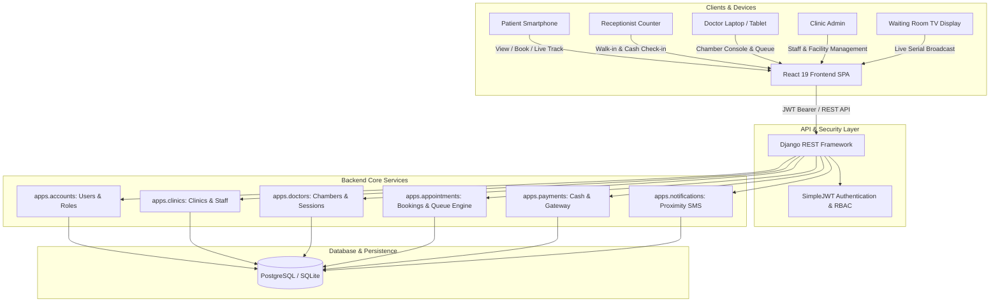
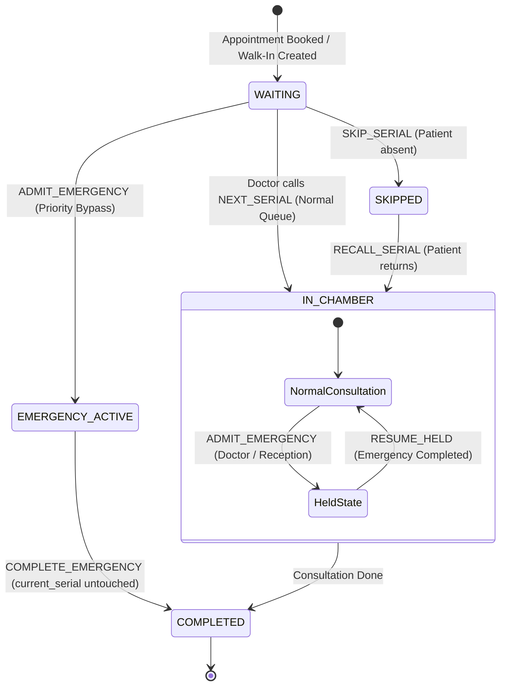

# 🏥 Smart Clinic — Multi-Clinic Healthcare Management & Digital Queue Orchestration Platform

<div align="center">


[](https://react.dev/)
[](https://tailwindcss.com/)
[](https://www.djangoproject.com/)
[](https://www.postgresql.org/)
[]()
[]()

**An enterprise-grade, distributed healthcare ecosystem bridging Clinics, Specialist Doctors, Receptionists, Patients, and Platform Administrators across Bangladesh.**

[Explore Features](#-key-features) • [System Architecture](#-system-architecture) • [Queue State Machine](#-digital-queue-engine--emergency-priority) • [Quick Start](#-quick-start-guide) • [Default Credentials](#-default-credentials-development) • [API Documentation](#-api-documentation)

</div>

---

## 🌟 Overview

**Smart Clinic** is a next-generation healthcare management platform and live chamber orchestration engine designed for busy clinics, multi-doctor medical centers, and hospitals.

It eliminates physical waiting room chaos, streamlines doctor-clinic partnerships, empowers clinics with virtual tour showcases, and delivers real-time live digital chamber queues for both online pre-booked appointments and walk-in counter patients.

Featuring **lossless thermal token generation with instant reprinting**, **role-based receptionist desks**, and a **zero-disruption emergency priority queue engine** that preserves patient serials without corrupting public displays or waiting calculations.

---

## ✨ Key Features

### 🏢 1. Clinic Administration & Multi-Chamber Management
- **Guided Clinic Onboarding**: Automated profile completion, geolocation coordinates capture (`📍 Use My Current Location`), certificate verification, and super-admin approval gate.
- **Visual Clinic Decorator & Virtual Tour**: High-resolution gallery management, virtual tour rooms (Reception, Chambers, Pathology, Emergency OT), with cover photo curation.
- **Diagnostic Catalog & Services**: 1-click bulk loading of standard Bangladesh diagnostic tests (ECG, USG, CBC, Fasting Glucose, Lipid Profile, Dental Scaling, etc.) with custom BDT pricing.
- **10-Point Facilities Matrix**: 24/7 Emergency, In-house Pharmacy, On-site Pathology Lab, ICU Beds, Wheelchair Accessibility, bKash/Card payments, and Blood Bank integration.
- **Staff Directory & Payroll**: Dedicated receptionist staff management, monthly salary tracking, and real-time biometric/manual attendance logging (`PRESENT`, `LATE`, `HALF_DAY`, `ABSENT`).

### 🩺 2. Specialist Doctor Console
- **Multi-Clinic Practice**: Doctors can practice across multiple registered hospitals and clinics with independent chamber schedules and pricing.
- **Live Chamber Console**: Real-time doctor chamber statuses (`In Chamber`, `Prayer Break`, `In Transit`, `Emergency Round / OT`, `Session Completed`).
- **Interactive Queue Controls**: Next Patient, Skip & Hold, Recall, and Reset controls with transactional concurrency locks.
- **Priority Emergency Tray & Held Patient Banner**: Seamlessly attend life-threatening emergencies with 1-click priority admission and automatically hold/resume the consultation of active normal patients.
- **Waiting Room Delay Broadcast**: Real-time delay broadcasting with custom audio/visual announcements pushed directly to waiting monitors.

### 👥 3. Front-Desk Receptionist Panel & Cashier Desk
- **Dual Front-Desk Workflow**: Unified walk-in counter creation and arrival check-in available through both the dedicated Receptionist Panel and Clinic Admin Chamber tabs.
- **Thermal Token Slip Generation**: Automated thermal token printing (`TokenPrintModal`) with clean 80mm printable layout, clinic branding, patient/doctor details, estimated consultation times, and dynamic QR tracking codes.
- **Lossless Token Reprinting**: Instant reprinting for lost or damaged tokens without creating duplicate appointments, regenerating serials, or corrupting queue positions.
- **Idempotent Payment Protection**: Built-in transactional safeguards and database-level OneToOne constraints preventing double-charging or duplicate payment receipts during repeated check-in or cash payment actions.

### 🚨 4. Zero-Disruption Emergency Priority Queue
- **Non-Advancing Serial Invariant**: Emergency priority admission strictly preserves `ChamberSession.current_serial`. Normal physical tokens remain 100% valid with zero renumbering or queue corruption.
- **Interrupted Consultation Preservation**: When an emergency is admitted while a normal patient is in chamber, the active patient is placed on `held_patient` status (never falsely marked as `SKIPPED`).
- **Next Candidate Precision**: Normal `NEXT_SERIAL` query strictly targets confirmed normal patients and permanently skips completed emergencies, preventing re-admission or skipped serial pollution.
- **Privacy-Safe Public Signage**: Waiting room TV displays announce priority medical attention without revealing confidential medical conditions or chief complaints.
- **Proximity SMS Alerts**: Intelligently targets the 3rd upcoming normal waiting patient without false triggers during emergency interventions.

### 📱 5. Patient Experience & Live Mobile Tracker
- **Smart Discovery Engine**: Multi-filter clinic and specialist doctor discovery by city, division, medical department, consultation fee, and available amenities.
- **Bilingual Interface**: Seamless instant English and Bengali (বাংলা) localization across all public views.
- **Live Digital Queue Tracker (`/track/<uuid>`)**: Real-time mobile queue tracking showing current serving serial, patients ahead, estimated wait time, emergency reassurance banners, and preparation tips.
- **Digital Prescription Verification**: Secure public cryptographic prescription validation portal.

### 📺 6. Public Waiting Room TV Display (`/waiting-room?clinic=<id>&doctor=<id>`)
- High-contrast, executive public display screen designed for 4K / 1080p wall-mounted waiting lounge TVs.
- Dynamic chamber status indicators, active serving token, upcoming serial predictions, and doctor status notices.

### 🛡️ 7. Super Admin Control Tower
- **Facility Verification**: Review submitted clinic registration certificates with Approve / Reject workflows.
- **Platform Analytics**: Multi-clinic appointment volumes, active practitioners, and system health monitoring.

---

## 🏛️ System Architecture


```mermaid
graph TD
    subgraph "Clients & Devices"
        P[Patient Smartphone] -->|View / Book / Live Track| FE[React 19 Frontend SPA]
        R[Receptionist Counter] -->|Walk-in & Cash Check-in| FE
        D[Doctor Laptop / Tablet] -->|Chamber Console & Queue| FE
        A[Clinic Admin] -->|Staff & Facility Management| FE
        TV[Waiting Room TV Display] -->|Live Serial Broadcast| FE
    end

    subgraph "API & Security Layer"
        FE -->|JWT Bearer / REST API| DRF[Django REST Framework]
        DRF --> Auth[SimpleJWT Authentication & RBAC]
    end

    subgraph "Backend Core Services"
        DRF --> Acc[apps.accounts: Users & Roles]
        DRF --> Cln[apps.clinics: Clinics & Staff]
        DRF --> Doc[apps.doctors: Chambers & Sessions]
        DRF --> Apt[apps.appointments: Bookings & Queue Engine]
        DRF --> Pay[apps.payments: Cash & Gateway]
        DRF --> Not[apps.notifications: Proximity SMS]
    end

    subgraph "Database & Persistence"
        Acc & Cln & Doc & Apt & Pay & Not --> DB[(PostgreSQL / SQLite)]
    end
```

---

## 🔄 Digital Queue Engine & Emergency Priority


```mermaid
stateDiagram-v2
    [*] --> WAITING: Appointment Booked / Walk-In Created
    WAITING --> IN_CHAMBER: Doctor calls NEXT_SERIAL (Normal Queue)
    
    state IN_CHAMBER {
        [*] --> NormalConsultation
        NormalConsultation --> HeldState: ADMIT_EMERGENCY (Doctor / Reception)
        HeldState --> NormalConsultation: RESUME_HELD (Emergency Completed)
    }

    WAITING --> EMERGENCY_ACTIVE: ADMIT_EMERGENCY (Priority Bypass)
    EMERGENCY_ACTIVE --> COMPLETED: COMPLETE_EMERGENCY (current_serial untouched)
    
    IN_CHAMBER --> COMPLETED: Consultation Done
    WAITING --> SKIPPED: SKIP_SERIAL (Patient absent)
    SKIPPED --> IN_CHAMBER: RECALL_SERIAL (Patient returns)
    
    COMPLETED --> [*]
```

### Core Engineering Invariants:
1. **Immutable Serial Identity**: `Appointment.serial_number` is assigned once and never mutates.
2. **Current Serial Preservation**: Admitting or completing an emergency never increments, decrements, or jumps `ChamberSession.current_serial`.
3. **No Blind Progression**: `current_serial += 1` is strictly forbidden; progression always evaluates the next confirmed, unskipped, non-emergency appointment via database query.
4. **Held vs. Skipped Separation**: Active patients interrupted by an emergency are placed on `held_patient` and never mixed into `skipped_serials`.

---

## 💻 Tech Stack

| Domain | Technology | Description |
| :--- | :--- | :--- |
| **Frontend Framework** | React 19 + Vite 8 | Ultra-fast client-side single page application |
| **Styling & UI** | Tailwind CSS + DaisyUI 5 | High-contrast, executive medical UI design system |
| **Icons & Media** | Lucide React | Featherweight modern icon library |
| **HTTP Client** | Axios | Configured with automatic JWT token refresh interceptors |
| **Backend Framework** | Django 5.x + DRF | Scalable, robust Python API backend |
| **Authentication** | SimpleJWT (JSON Web Tokens) | Multi-role access (`PATIENT`, `DOCTOR`, `CLINIC_ADMIN`, `RECEPTIONIST`, `ADMIN`) |
| **Database** | SQLite (Dev) / PostgreSQL (Prod) | Normalized relational models with automated migrations |
| **Concurrency Control** | `select_for_update()` & `transaction.atomic()` | Atomic queue state transitions and idempotent payment handling |
| **Documentation** | OpenAPI 3.0 + Swagger / Redoc | Interactive API discovery & schema endpoints |

---

## 🚀 Quick Start Guide

### Prerequisites
- **Node.js**: `v18.x` or higher
- **Python**: `v3.10` or higher
- **Git**

---

### 1. Clone the Repository
```bash
git clone https://github.com/Ishtiak-Ahmed886/Final_Year_Project_version1.git
cd Final_Year_Project_version1
```

---

### 2. Backend Setup (Django)

```bash
cd clinic_backend

# 1. Create and activate virtual environment
python -m venv venv

# Windows:
venv\Scripts\activate
# Linux/macOS:
source venv/bin/activate

# 2. Install dependencies
pip install -r requirements.txt

# 3. Apply database migrations
python manage.py migrate

# 4. Seed realistic demo data across all 8 administrative divisions
python seed_eight_divisions.py

# 5. Start the backend server
python manage.py runserver
```
Backend API will be accessible at: `http://127.0.0.1:8000/`

---

### 3. Frontend Setup (React + Vite)

Open a new terminal window:

```bash
cd smart-clinic

# 1. Install npm dependencies
npm install

# 2. Start the Vite development server
npm run dev
```
Frontend client will run at: `http://localhost:5173/`

---

## 📑 Default Credentials (Development)

All seeded development accounts across the 8 administrative divisions share the standard development password: `Password123!`.

| Role | Email | Password | Division / Region |
| :--- | :--- | :--- | :--- |
| **Super Admin** | `admin@clinic.com` | `Password123!` | Nationwide Control |
| **Clinic Admin** | `metro_dhaka@clinic.com` | `Password123!` | Dhaka (Uttara) |
| **Clinic Admin** | `nexus_mymensingh@clinic.com` | `Password123!` | Mymensingh |
| **Receptionist** | `staff_metro@clinic.com` | `Password123!` | Dhaka (Uttara) |
| **Specialist Doctor** | `nurul_rangpur@doctor.com` | `Password123!` | Rangpur |
| **Specialist Doctor** | `tariqul_ctg@doctor.com` | `Password123!` | Chattogram |
| **Patient** | `test_patient_e2e@example.com` | `Password123!` | Dhaka |

---

## 📖 API Documentation

With the backend running, explore interactive endpoints at:
- **Swagger UI**: [http://127.0.0.1:8000/api/docs/](http://127.0.0.1:8000/api/docs/)
- **Redoc UI**: [http://127.0.0.1:8000/api/redoc/](http://127.0.0.1:8000/api/redoc/)
- **OpenAPI Schema**: [http://127.0.0.1:8000/api/schema/](http://127.0.0.1:8000/api/schema/)

---

## 🧪 Testing & Quality Assurance

### Backend Unit & Integration Tests (38 Tests Passing)
```bash
cd clinic_backend
python manage.py test apps.clinics apps.appointments
```

### Frontend Production Build
```bash
cd smart-clinic
npm run build
```

---

<div align="center">
  <sub>Engineered with care for better healthcare access in Bangladesh. Crafted by <a href="https://github.com/Ishtiak-Ahmed886">Ishtiak Ahmed</a>.</sub>
</div>
